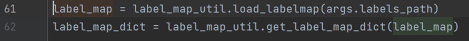
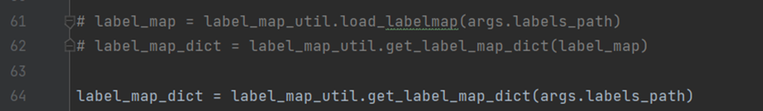

# Error sheet


##Harvesters
Import error cannot import name random.py

The cause may be that you created a file/script called random.py in the directory. <br>
To solve the error it is recommended to rename the created random.py file to  e.g. random2.py. <br>

###IndexError: list index out of range <br>

Steps to try when this error occurs <br>
Step 0: camera might not fully initialized yet retry to run the code<br>
Step 1: check if the camera is connected and working <br>
Step 2: Try to connect the camera with a different data cable and adapter( if you use one)<br>
Step 3: Make sure the path to the gentlproducer.cti file is correct<br>
Step 4: check if you have the right interpreter 3.6< or above<br>
Step 5: Make sure you installed the right gentlproducer for the camera<br>
Step 6: make sure Harvester is reset after task completion by adding at the end of your code h.reset() <br>

MatrixVision = https://www.matrix-vision.com/en/downloads/drivers-software/mvbluecougar-gigabit-ethernet-dual-gigabit-ethernet-10gige-ethernet/windows-7-8-1-10

file= mvGenTL_Acquire-x86_64-2.48.0.exe


Allied Vision Manta = https://www.alliedvision.com/en/support/software-downloads/

file = Vimba_v6.0_windows 

Note: If allied vision manta doesn’t work with the manta gentl.cti file try to use the cti file from matrix vision it should start the camera and gain images.

#Tensorflow

Protobuf builder.py not found

- First install the latest protobuf version with: ```pip install -–upgrade protobuf``` <br>

- Then go to your interpreter path where protobuf is located e.g. C:\Users\alex4\anaconda3\envs\tensorflow\Lib\site-packages\google\protobuf\internal <br>

- Next step copy paste the builder.py to your desired file e.g. Documents and then install the required protobuf version for your module recommended is 3.19.4. <br>

- Go back to where the builder.py was allocated in the interpreter check e.g. path from above and check if there is a builder.py in the interpreter files if not you can copy paste the one you saved e.g. Document. <br>

This should solve the problem.

###No module named 'tensorflow.compat:
When this error occurred it can be bc one of .py modules as the wrong function <br>

From label_map_util.py replace on line 133: 

code to change: ```with tf.gfile.Gfile(path, 'r') as fid:```

 change to: ```with tf.io.gfile.GFile(path, 'r') as fid:```


  
###When labelmap gets invoked: 

From generate_tfrecord.py replace on line 61 and 62: 



With:
```label_map_dict = label_map_util.get_label_map_dict(args.labels_path)```

result should be:  


the two lines(61 & 62) with the # can be deleted or commented out

###no model_lib_v2.py

if this file is missing add the file from: to the object-detection package at your interpreter site-packages>object detection.<br>
link: https://github.com/tensorflow/models/blob/master/research/object_detection/model_lib_v2.py <br>

#Socket Server errors

###Socket server doesn’t  bind <br>
Steps to try when this error occurs <br>

Step 1:  Before opening a socket server try to close it with .close() it first because it can be so that the server never was close. This can lead to that the server cannot bind because it trying to open a socket that’s already open. <br>

Step 2: check the Ip address if it matches you can use command prompt and type: netstat -arp to look for the necessary IP address to start a local Host.<br> 

Step 3: Give the python and rapid code time to communicate with each other by placing a time.sleep() between the connection lines. This way it gives the devices enough time to properly connect has shown below.<br>

Step 4: restarting your pc could help the problem out
If Rapid cannot bind the IP and port number the steps above can solve the problem if it doesn’t help the following code can be added to the rapid script to make it work. This code retries to bind and gives it a max wait time to bind with the Host. This can prevent the binding from failing.<br> 
####note: Place this code at the end of your code if not it can stop your script from running

            IF ERRNO=ERR_SOCK_CLOSED THEN
                RETRY;
            
            ELSEIF ERRNO=ERR_SOCK_CLOSED THEN
                SocketClose socket1;
                SocketCreate socket1;
                SocketConnect socket1, sockIP, sockPort\time:= WAIT_MAX;
                
                RETRY;
            ELSE 
                Stop;
            ENDIF
                
        
    ENDPROC
###Cannot receive data through socket server 

To solve this issue it is important to make sure that the data is encoded before sending if not it can give an error and no data will be received on the other end.<br>
e.g.: ```#encoding before sending``` <br>
```       conn.send(send_coord.encode())  ``` 

